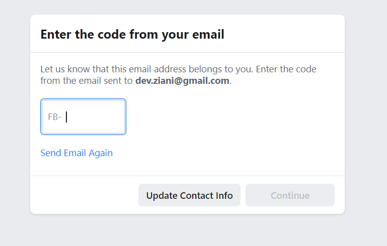

# Authentication Module 
//TODO : description of the authentication module

 

## Feature list
1. Enroll new users and authenticate them
2. Give to each user a profile personal page to edit
3. Regulate user access throughout the platform

 

## Feature description

Enroll new users and authenticate them

	The user should be able to register an account through a dedicated page
		○ Regular registration | Google registration
		○ You need to record sensible data (birthday / gender) It is better to have a 2 step registration
			§ Separate component (used later by regular road vs google road)
		○ Email verification : Code or link confirmation , make sure user can't go homepage until process is completed
		○ Optional: Getting started process to select cool pages at registration.
	
	
	Redirection if the authentication module:
	Verify email component:
		If logged In and email not verified redirection to VerifyComponent.
			He clicks on the link then redirection to success then redirection to homepage
		What is the nominal case ?
		User signup , server sends an email, user has a first redirection to verify-email, user clicks on the activation link, then he has message that he succeeded then he is redirected to homepage
		
		What if the user never clicks on the link ? Well he will be forever redirected to verify-email, 
		what if the user want to be signed out  ?, the user should be able to signed out if he fucked the email
		If you refresh the page you update your information on verify email
		
		The only neat thing to investigate is when the user clics the link with success message and closes the message and stays on verify email (kinda we don't care)
			In this case you might consider some form of periodic check
		
	Join Us:
		○ Handle case Mail already in Use
		○ Handle password is too weak

Global to this module:
	 If unlogged => access to everything AND no access to verify + redirection to signin page 
	 If logged => unauthorized to access any part of the module until you disconnect (no signin / signup etc) EXCEPT verify email 

 

## Identified class of problems

	1. How to organize backend communication in Angular ?
		a. Abstractive Service layer wrapping firestore ?
		b. Utilities function stack etc
	2. I have this problem with business models , polimorphics models etc
		a. Like, same model User can be used in different ways with different portions depending where.
		b. Considerations:
			i. Options / Settings options separate from "business" models ?
			ii. Using heritage ?
How to store in firestore ? Firestore centric view VS Template centric view

 

## Wireframes

Enroll new users and authenticate them  
Step 2/3 Sign-follow-up

 

Step 3/3 Redirected and Logged to homepage  
