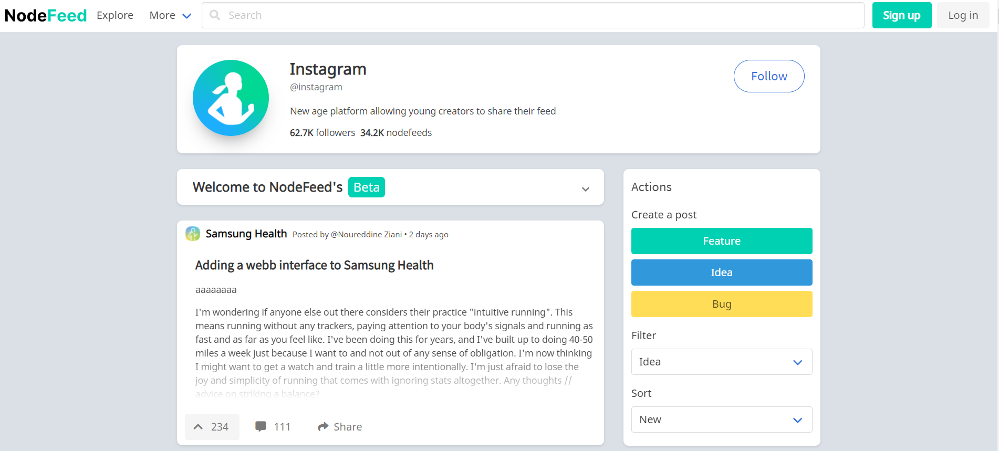

# Welcome to the official functional documentation

A functional specification describes how a product will work entirely from the user’s perspective. It doesn’t care how the thing is implemented. It talks about features. It specifies screens, menus, dialogs, and so on.

* You have modules wich are a collection of features limited to a semantic scope
  * Features: wich are a specific  self-contained user requirement
  * User story wich is the human readable explanation of a given feature
  * Specifications: more narrow requirements of a given feature 

## What is Nodefeed ?

The core idea is to create a social media platform between customers and companies in order to share ideas , give feedback and request features and bug fixes ala github ala reddit.

### Overal description

Mon projet et ma vision est de développer une plateforme web permettant de mettre en relation des produits à des utilisateurs. Le projet est nommé NodeFeed. Les utilisateurs peuvent créer une page nodefeed de leur produit favori (ex: page nodefeed d'un jeu, une page sur une application comme google calendar) et créer des posts (poster une idée ; remonter un bug, demander une fonctionnalité etc). Ce genre de prise en charge existe mais de manière fragmenté à travers des forums, site SAV, Twitter, etc. Ici l'innovation réside dans la centralisation et le référencement de ces requêtes tout en proposant une expérience "Réseau social" (Postes, likes, commentaires, communautés). Pour illustrer ce projet imaginez une "fusion" d'une plateforme comme Reddit avec Trustpilot. Le business model est assez direct ; la valeur ajoutée réside dans le fait que cette plateforme va permettre aux utilisateur de participer à l'évolution des produits proposés par une entreprise de manière direct et décentralisé. ِConcrètement une fois une userbase conséquente ces pages pourront être "claim" en souscrivant a un abonnement par les entreprises concernés et acquérir un statut vérifié. Dans ce formalisme SaaS BtoCtoB  les entreprises (nos clients) pourront accéder à des services de gestion de cette page, à des statistiques, etc.

Websites that overlaps with the Nodefeed core's functionalities:

* Amazon / TrustPilot: Retailers offering ratings and reviews.
* Product Search/Comparator engine: Google shopping and PriceGrabber.
* Community based pages: Reddit
* Feedback/Bug report system: Github

Cool features that I might add later:
	• Powerful and huge repository of products
	• Product comparator
	• Find where to buy the product
	• Add Nodefeed badge
	
	
Pour le systeme de claim s'inspirer de google maps claim un magasin  

### What is not
    It's not Google shopping , because products are created by users, and because is created by  users the product listing will be organic, you will not have products without communities, you will have several products linked to one community. (incentives to enforce)

What you should see on the feed (imagine Iphone feed)

Its not reddit so what is it ?
Bug reporting
Ideas
News  

 

### Home page demonstration

## Business model
Will be close to linkedin model:

Main source of profit will be premium subscriptions where I offer statistical data/admin access to products of the company
Secondary sources (most to least important)
	• Sponsored content / Classic Ads business model (like any social media)
		○ Very strong because we are already in a spending platform , its not snapchat
	• Referes program that goes with advanced features for example comparators/links to sellers etc.
Other exotics avenues: crypto / platform-money / reputation etc etc.

## Design: Vision and Values:
	- Fall into minimalism : Cut to the chase accessibility , streamlined , nippon/jp , 2000's web 
	- Fall into capability , functionnal features -> speed tool
	- Then build back up through refactoing to offer design
The delta time between feature functionality completion and redesign work shouldn't take too little time no too much time

## Main Modules List

1. **[AuthenticationModule](AuthenticationModule/authentication-module.fspec.md)** :  
    The module that allows users to register, sign in and out and regulate access throughout the platform

2. **[UserModule](UserModule/ll)** :  
    All the relevant pages to a given user, profile page , settings page etc, see followings.  Account type etc
    Echelon 0: Simple page with displayed information

3. **[FeedModule](FeedModule/feed-module.fspec.md)** :  
    All the relevant components to the general feed, buttons to post, related node feed , infibite scrolling 
    Nofefeed page, posts and comments common display, edition of nodefeed page , follow it etc
    Echelon 0: Create a page , see posts, follow a page

4. **[PostModule](PostModule/post-module.fspec.md)** :  
    The edition and posting of a nodefeed article, all the interaction ina given post and comment (likes and stuff)
    Echelon 0: simple text post

5. **[SearchModule](SearchModule/search-module.fspec.md)** :  
    The ability to explore different products, suggest products , creating categories , search engine etc
    Echelon 0: searching a page

6. **PricingModule** :  
    Pricing page, cash up process , assitance etc
    Echelon 0: none

7. **LandingPagesModule** : Legal pages etc

8. **AnalyticsModule** :  
    Statistical analysis pages and trackers for premium subscribers

9. **AdministrationModule** :  
    Moderation pages, regulate users in the GUI etc
    Help pages , contact us , ticketing , flag posts etc

10. **ProductionCIModule** :  
    User number loading tests, performance tests, deployments , production , general testing

11. PlatformsModule :  
    Mobile versions, general responsivity , etc

 
 

### Oberview of the main model concepts	

* NodeFeed Page: community around a product or a service 
  * Collection: nodefeeds
  * Title
  * Name
  * FollowersCounter
  * PostsCounter
  * Description
  * Picture

* Collections : Posts
  * Title
  * Author ID
  * Type
  *  Date
  *  Content
  *  Nodefeed ID
  *  LikeCounter
  *  CommentCounter
  
* Collection: Comments
  * Comment
  * Author ID
  * LikeCounter
  * Users
  * Nickname
  * DateJoined

### Feature concept
A collection of coherent use cases, usually around one page, they heavily share components between them as well as services. A feature offers one functionality.

Feature modules are intended to be self contained.

Each module has a specific scope, e.g. CommentModule, ProfileModule, FeedModule, PhotoModule, ShareModule, LikeModule, etc
Preferably without too many links between each module

