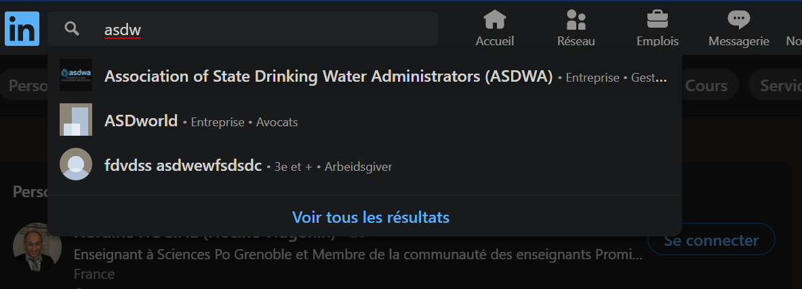
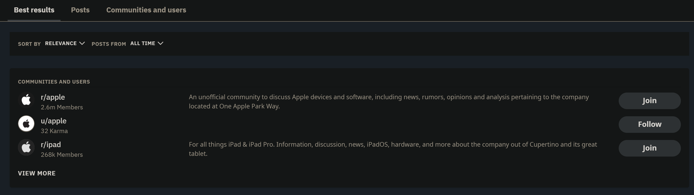

# Search module

## Features:

    1. Search a nodefeed page and create if not found. [ECHELON 0]
    2. The ability to explore products, suggest products
    3. Categorization of nodefeed pages
    4. Advanced research of posts across pages etc.

## Wireframes

### Preview Search apge
 

I don't need to wireframe for that shit , Just basic stuff for now:  

#### Specifiations

* Mainly to search nodefeed pages

* You can click on "more results" to land on a dedicated search page 

* You will also have a button to create a page (present in preview pane and search page)

* Later possibility to search posts / maybe users

* Color markers to distinguih product categories

 

### Landing search page

#### Specifications

* Echelelon 0
    * Display all nodefeed page results
    * A button allowing you to create one page 
